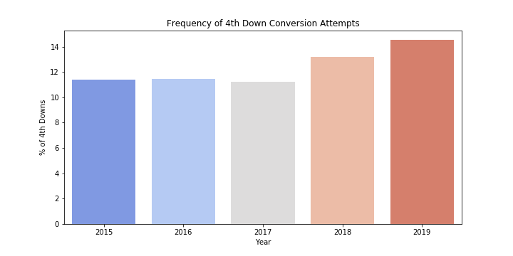
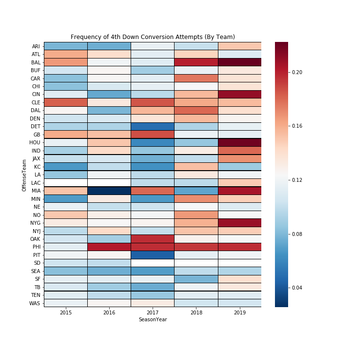
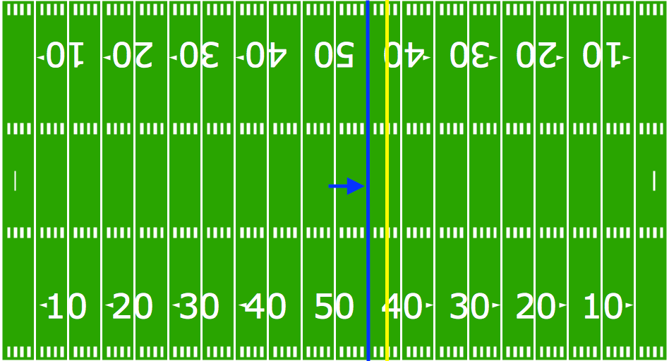

### Intro/Motivation

4th Down. 1 yard to the endzone. ~30 seconds left in the half of the Super Bowl. The Philadelphia Eagles have a choice to either kick a relatively easy field goal and take 3 points, or go for the touchdown and risk coming away with nothing before the half.

That iconic situation preceded perhaps the most memorable play in recent Super Bowl history, "The Philly Special". However, there was a similarly important and less known 4th Down choice that the Eagles had later in that game. 4th Down and 2 on the PHI 45, 5:39 left in the 4th quarter down 33-32. In this situation, the stakes where higher and the margin of error was lower so late in the game.

So should the Eagles go for it? If so, should they pass it or run it? What  type of play should the Patriots defense have expected in that situation?

These questions can be answered through coaches' debates, understanding of the game, or even the subjective feel. Doug Pederson, the Eagles coach, ignored all of these and instead chose data. What does the data say?

To answer that, we're going to need to take a closer look:

### A First Look

First instinct is to take a look at how often teams go for it on 4th downs. 

Clearly, teams around the league have been increasingly more inclined to go for it in 4th downs. However, this general trend has differed across different teams.

Below we can see the differences between various teams in their willingness to attempt a 4th down conversion through the last five years. The Eagles (PHI) clearly stand out, consistently going for it on 4th downs more often than most of the league since 2016, the year Coach Pederson was hired.

This paints a picture, but ultimately  what a coach needs to make that key Super Bowl decision is an anaytical model that guides his decision making and play choice in these incredibly significant game moments. 

### The Model

#### The Situation
- 4th and 2 at OPP 43 yard line
- 4rd and 1 at OWN 38 yard line
- 4th and 5 at OPP 12 yard line 
- 4rd and Goal at OPP 2 yard line

These are just a few in-game 4th down situations that could arise within an NFL game. The decisions made in these situations can often be game-altering. 

Given a 4th Down situation, consisting Yards to Go, and Yardline, and time left in the half, what should a coach choose to do?

First, lets attempt to define a specific situation.
- 4th Down
- 0-5 Yards to Go

In the last 5 NFL seasons, there have been 7881 4th and (0-5) yards-to-go situations with an average of 2.847 yards to go at an average yardline position of the OPP 45 yard line.

[NFL PlaybyPlay GitHub Repo](https://github.com/shahv1057/NFL_PBP)

